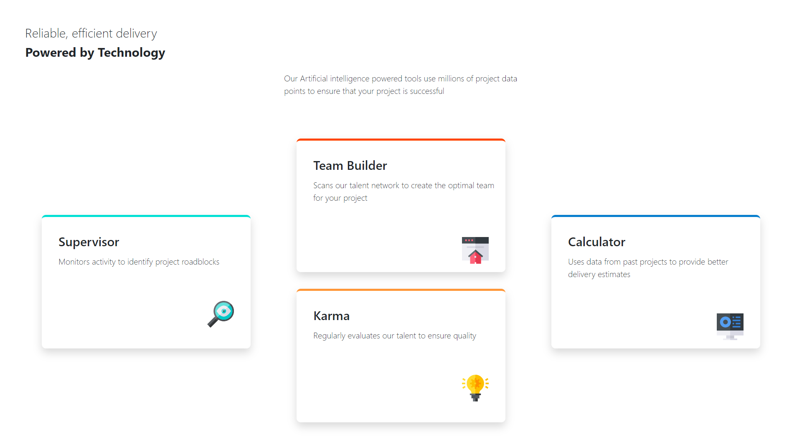

# Mock-UI
This project was aimed at recreating a design mock up using React and Bootstrap.

Live test URL: https://mock-ui.vercel.app/


<p align="center">
  
</p>

## Development

To get a local copy of the code, clone it using git:

```
git clone https://github.com/musa-bello/Mock-UI
cd Mock-UI
```

Install dependencies:

```
npm install
```

Finally, you need to start a local web server. Run:

```
npm start
```